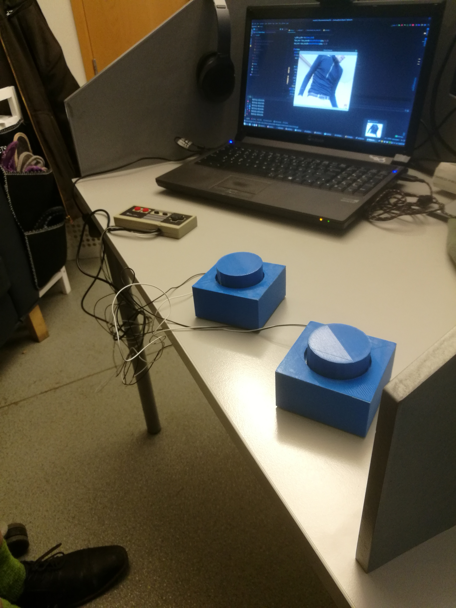

# Example usecase.
This given example was run using Linux Mint 18.3 as operating system.

#### Requirements
* [antimicro](https://github.com/AntiMicro/antimicro)
* [Requirements for Rhino](https://github.com/AndreasJacobsen/noseCV/blob/master/README.md)
## Alternate input
Rhino can use any input from input devices supported by the OS, including [compose key](https://en.wikipedia.org/wiki/Compose_key) input.
This enables us to use alternate buttons, in this project we used two  [3D printer buttons](https://www.thingiverse.com/thing:14887) connected to a retrolink NES controller.

You can define what buttons you want to be the mouse buttons in this part of the code

```python
      if cv2.waitKey(1) & 0xFF == ord('r'):
                m.click(x * 4, y * 4, 2)
                print("CLICK")
      if cv2.waitKey(1) & 0xFF == ord('l'):
                m.click(x * 4, y * 4, 1)
                print("CLICK")
```
Here `ord('r')` allows you to right click using the r key and `ord('l')` allows you to left click using the l key. These can be changed to anything you want, if you are using direct ASCII values remove the "ord" part.


By using antimicro we were able to map the two 3D printed keys connect to a NES controller to the r and l key. Allowing users to press these instead of the keyboard. As these buttons were large and have long cables we can using this method allow users to press keys using their feet.

With this setup the user was able to controll the mouse using the nose and push right and left mouse buttons using the users feet.


<br>

<br>


